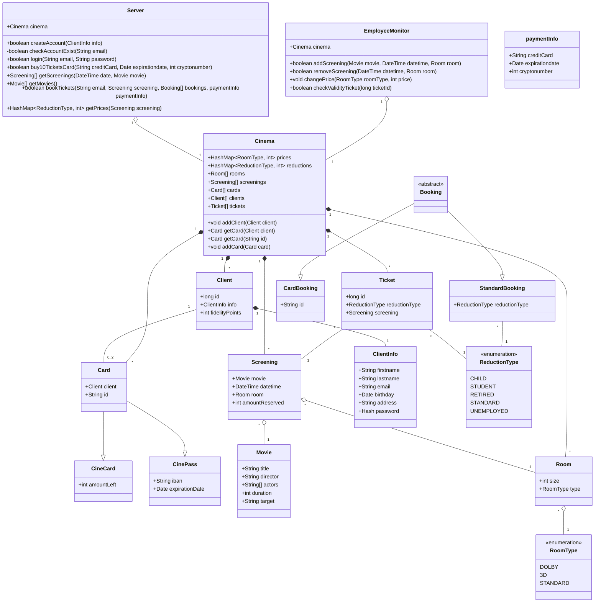
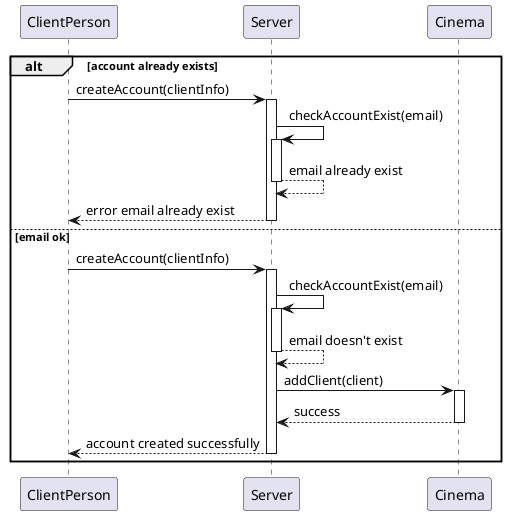
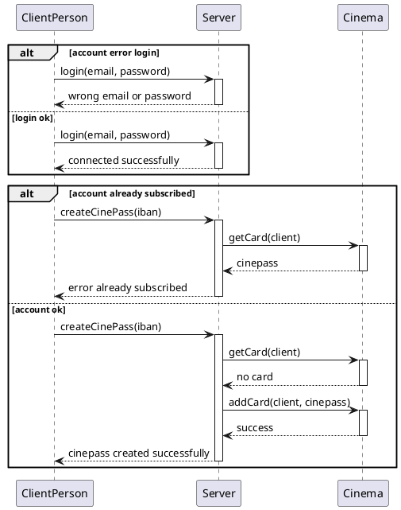
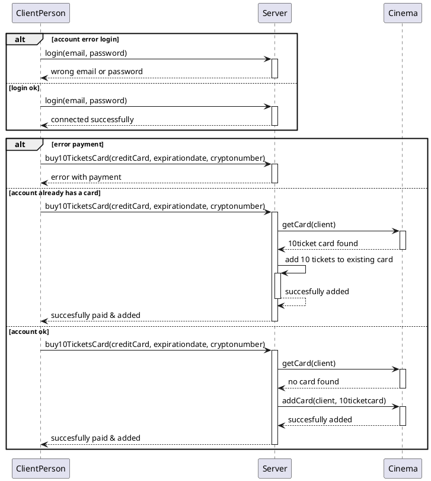
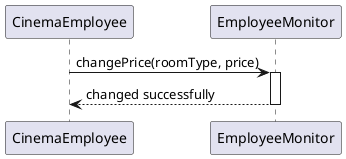
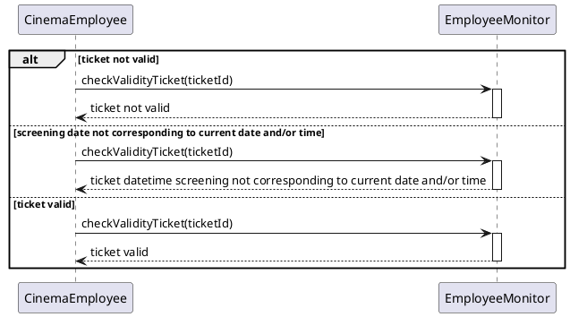
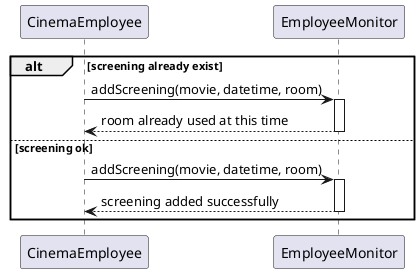
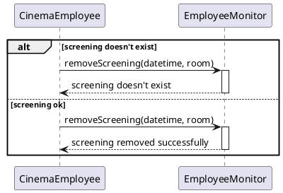
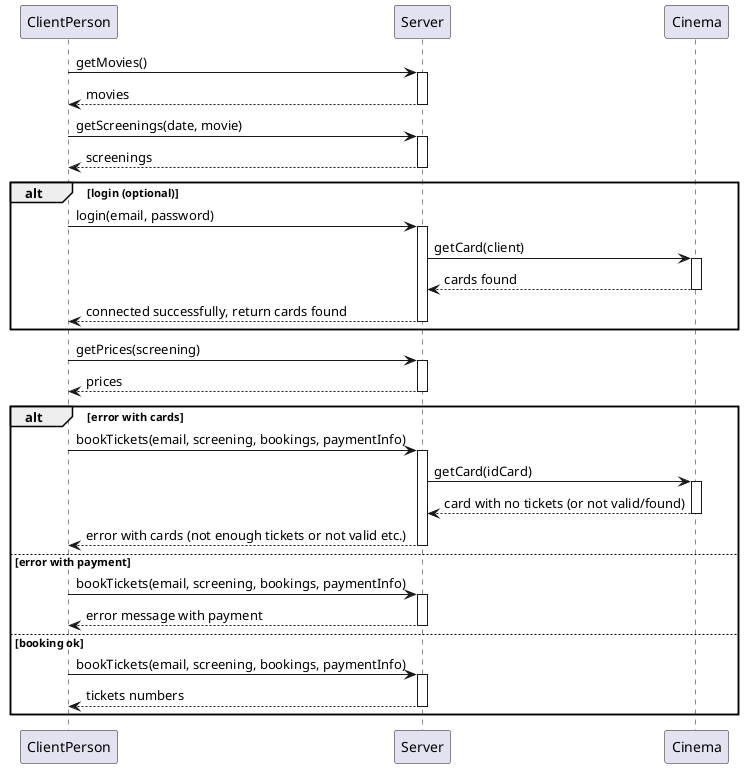

# Diagrammes de séquence

## Créer un compte de fidelité

## Souscrire à un abonnement Cinépass

## Réserver 10 séances à un tarif avantageux (cinécarte)

## Changer la grille tarifaire

## Vérification de validité d'un ticket

## Gérer la répartition des séances dans les salles

## Réservation sur le site internet ou sur la borne

