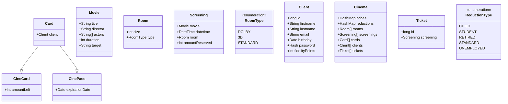

```mermaid

classDiagram

    Card --|> CineCard
    Card --|> CinePass

    class Movie{
        +String title
        +String director
        +String[] actors
        +int duration
        +String target 
    }

    class Room{
        +int size
        +RoomType type
    }

    class Screening{
        +Movie movie
        +DateTime datetime
        +Room  room
        +int amountReserved
    }

    class RoomType{
        <<enumeration>>
        DOLBY
        3D
        STANDARD
    }

    class Client{
        +long id
        +String firstname
        +String lastname
        +String email
        +Date birthday
        +Hash password
        +int fidelityPoints
    }

    class Card{
        +Client client
    }

    class CineCard{
        +int amountLeft
    }

    class CinePass{
        +Date expirationDate
    }

    class Cinema{
        +HashMap<RoomType, int> prices
        +HashMap<ReductionType, int> reductions
        +Room[] rooms
        +Screening[] screenings
        +Card[] cards
        +Client[] clients
        +Ticket[] tickets
    }

    class Ticket{
        +long id
        +Screening screening
    }

    class ReductionType{
        <<enumeration>>
        CHILD
        STUDENT
        RETIRED
        STANDARD
        UNEMPLOYED
    }
```