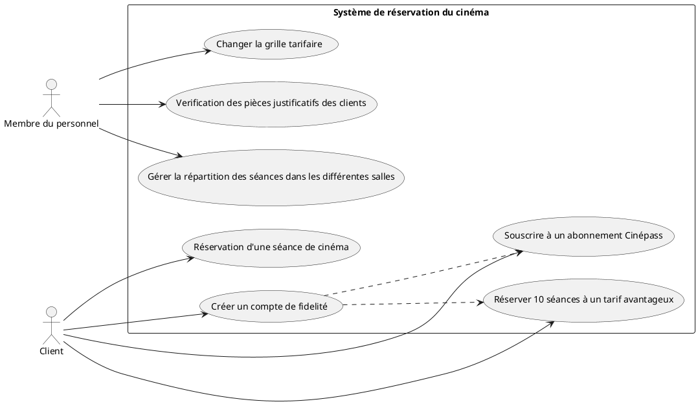

```plantuml
@startuml
left to right direction

actor "Client" as c

actor "Membre du personnel" as p

rectangle "Système de réservation du cinéma" {
  usecase "Réservation d'une séance de cinéma" as UC1
  usecase "Gérer la répartition des séances dans les différentes salles" as UC2
  usecase "Créer un compte de fidelité" as UC3
  usecase "Souscrire à un abonnement Cinépass" as UC4
  usecase "Réserver 10 séances à un tarif avantageux" as UC5
  usecase "Changer la grille tarifaire" as UC6
  usecase "Verification des pièces justificatifs des clients" as UC7
}
c --> UC1
p --> UC2
c --> UC3
c --> UC4
c --> UC5
p --> UC6
p --> UC7

UC3 -.-> UC4
UC3 -.-> UC5
@enduml
```
