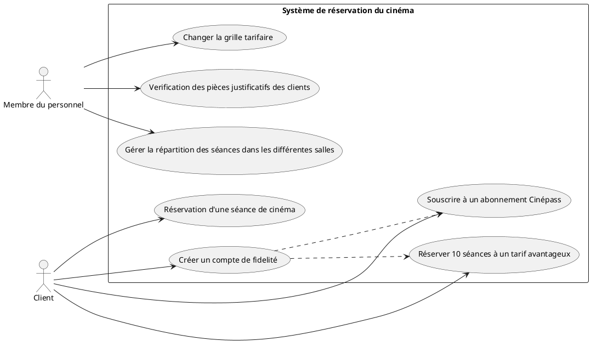

# Diagrammes de séquence système

## Créer un compte de fidelité
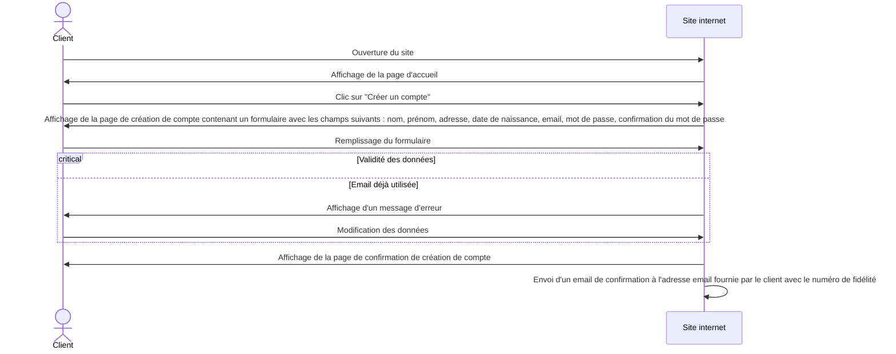

## Souscrire à un abonnement Cinépass
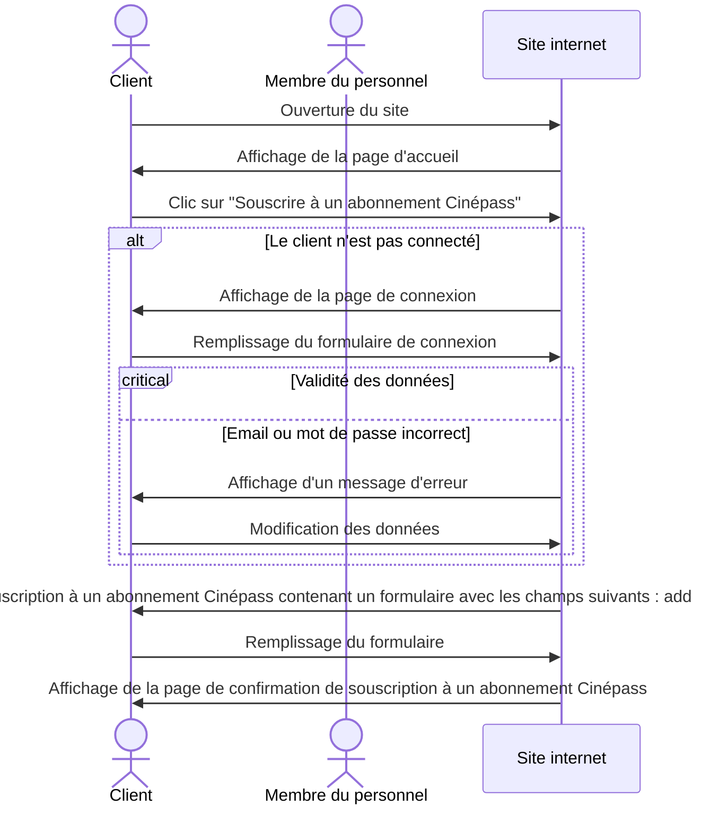

## Réserver 10 séances à un tarif avantageux (cinécarte)
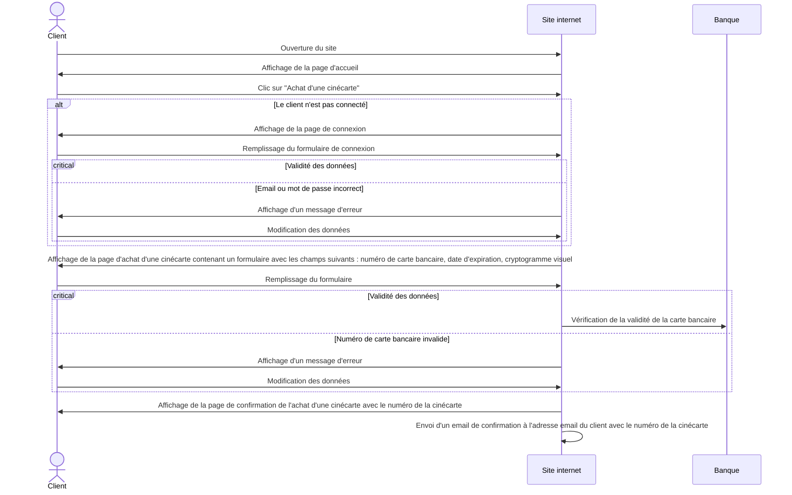

## Changer la grille tarifaire
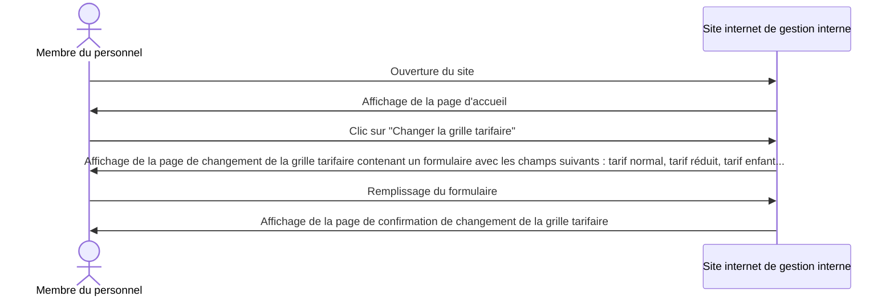

## Vérification des pièces justificatives des clients
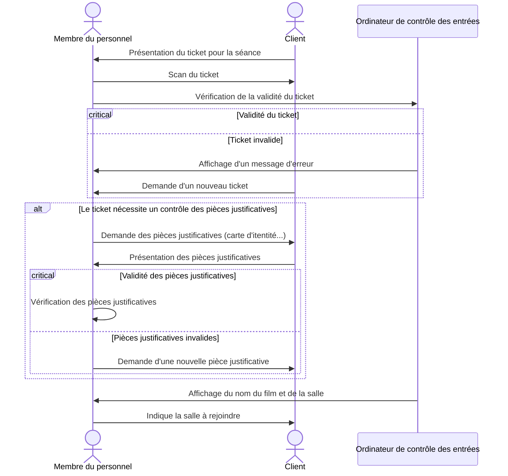

## Gérer la répartition des séances dans les salles
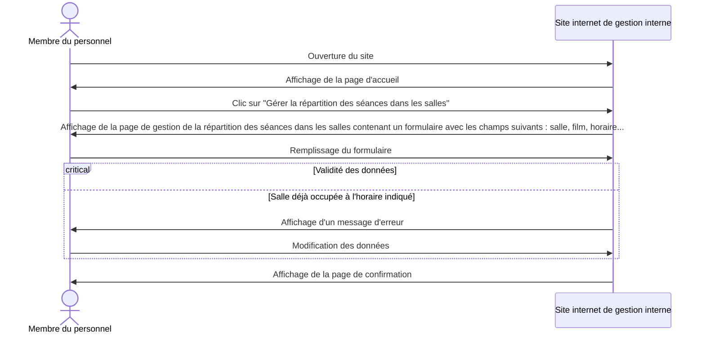

## Réservation sur le site internet 

### Avec un compte

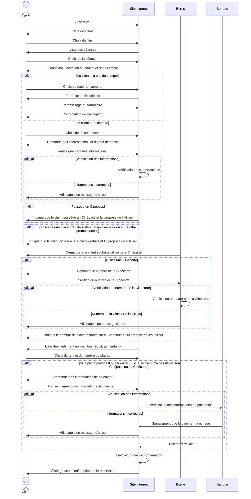

### Sans compte

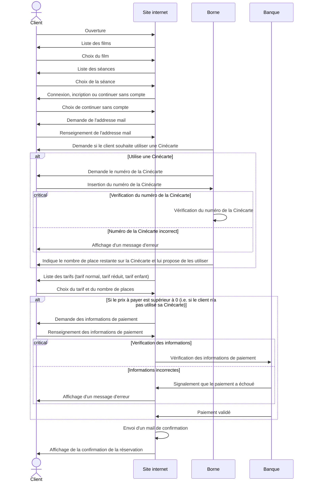

## Réservation sur la borne
### Sans compte

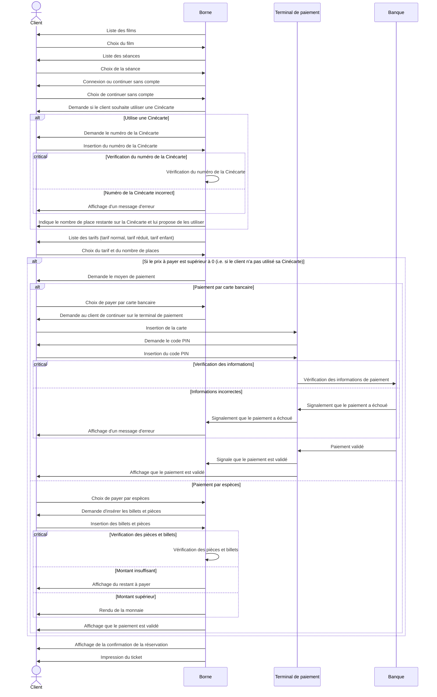

### Avec compte

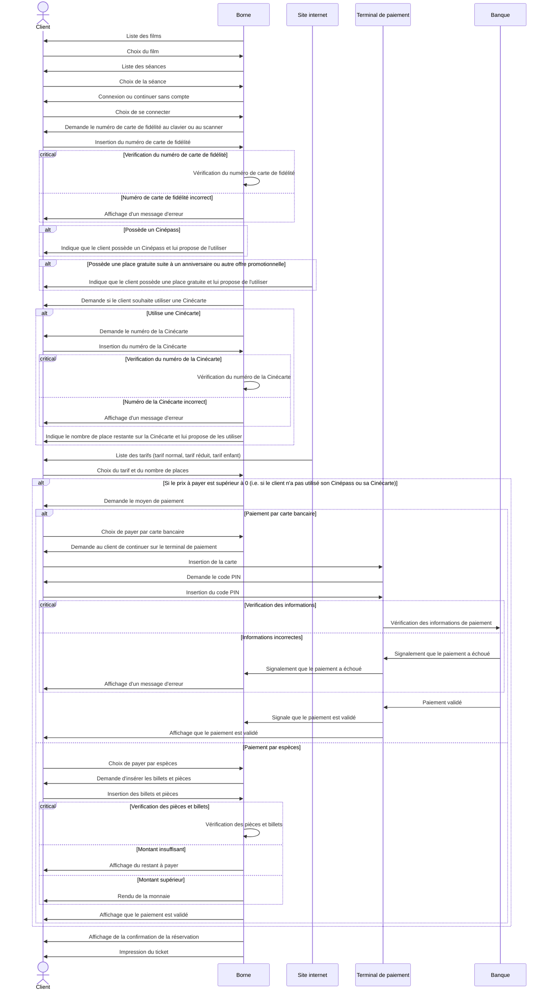