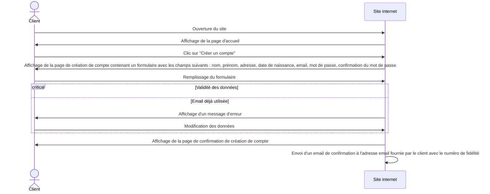
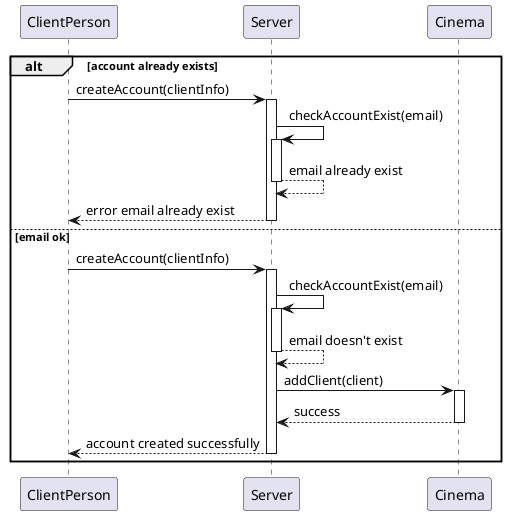
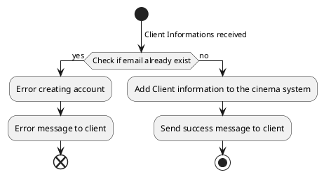

## Analyse Fonctionnelle

## Analyse Comportementale

### Diagramme de Séquence :

### Diagramme d'Etats :

L'utilisateur peut faire le choix de créer un compte client pour le cinéma. Pour cela, il doit se rendre sur le site du cinéma.
Sur celui-ci, il pourra trouver un bouton pour créer un compte qui l'amenera vers un formulaire de création de compte. Il pourra alors remplir les données utilisées pour la création d'un compte (nom, prénom, email, date de naissance, adresse et son mot de passe).
Une fois renseignées, ces informations sont envoyés au système et execute la fonction createAccount qui commencera par vérifier que la personne ne possède pas déja un compte. Si elle possède deja un compte, elle lui renverra un message d'erreur. Sinon elle stockera les informations du client comme compte client dans le système.
Le client recevra alors un message de succès.