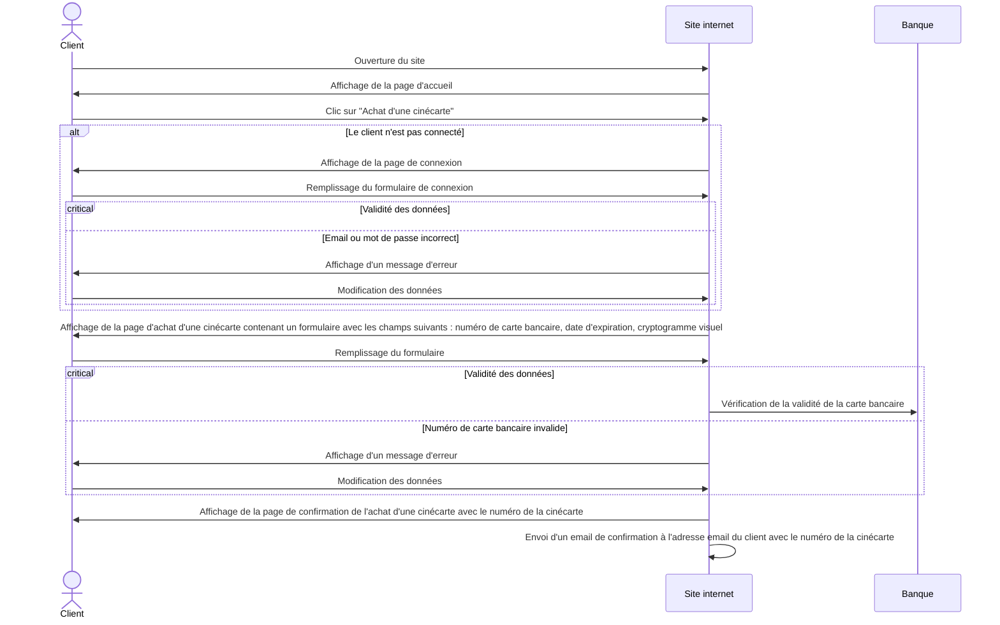
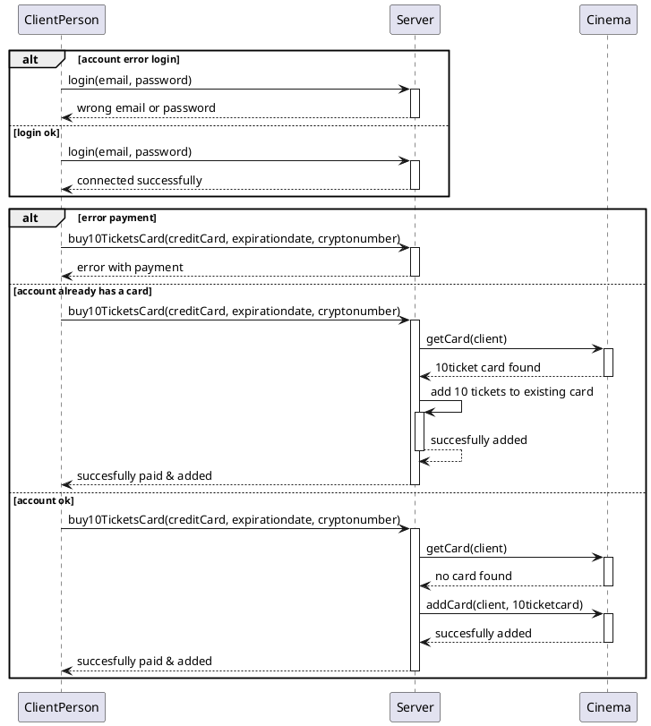
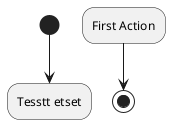

## Réserver 10 séances à un tarif avantageux (cinécarte)

### Analyse Fonctionnelle

## Analyse Comportementale

### Diagramme de Séquence :

### Diagramme d'Etats :

Un client peut faire le choix d'acheter 10 places de cinéma en meme temps pour un prix plus avantageux. Ces places seront assignées à une carte lui permettant de réserver des séances cinémas en renseignant le numéro de carte.
Pour réserver 10 places, le client doit se rendre sur le site internet. Il peut alors ensuite cliquer sur un bouton "Achat d'une cinécarte". Il est alors invité à se connecter. Cette connexion est requise pour réserver les 10 places. Si il n'a pas de compte, il est invité à un en créer un. Sinon il peut renseigner ses informations de connexions. Le système reçoit ces informations et vérifie bien qu'elles correspondent bien à compte client. Si ce n'est pas le cas, elle renvoie un message d'erreur au client.
Sinon celui-ci est connecté et la page de paiement s'affiche devant lui. Il peut alors renseigner ses informations de paiements et valider. Les informations de paiements sont envoyés au serveur ainsi qu'un token (qui est généré lorsqu'un client se connecte). Ce token est utile pour reconnaitre quel client fait la requete au serveur.
Le système vérifie dans un premier temps que le client ne possède pas deja une carte contenant des places, si c'est le cas, il ajoutera 10 places à la carte si les informations de paiement sont corrects. Nous avons fait le choix de ne pas recréer de carte à chaque fois pour que le client puisse conserver toujours la meme carte et la recharger quand il le souhaite. 
Si le client n'a pas de carte, une carte est alors créer avec 10 places dessus. Un message de succès est ensuite envoyé au client pour lui confirmer l'achat. Néanmoins, si le paiement échoue, un message d'erreur lui sera retourner l'invitant à revérifier ses informations de paiements.

