# TP1 · Conception Orientée-Objet
## Mael KERICHARD - Romain BRIEND

L’objectif de ce TD/TP est de préparer un dossier complet d’analyse et de conception par Objet à partir d’un cahier des charges.
Ce cahier des charges concerne un système de réservation d'un cinéma.

## Diagramme de cas d'utilisation

Nous avons identifié 8 cas d'utilisation de notre système. Nous avons tout d'abord les cas d'utilisation d'un employé du cinéma. Celui-ci peut changer la grille tarifaire, vérifier la validité d'un ticket de cinéma ainsi que de gérer la répartition des séances dans les salles. D'un autre coté, nous avons le client qui peut réserver un ticket de cinéma et créer un compte de fidélité. Si il possède un compte de fidélité, il peut alors également souscrire à une carte comportant 10 tickets à prix réduits ou alors à un abonnement cinéma illimité. Si il possède un abonnement, il peut alors se désinscrire.

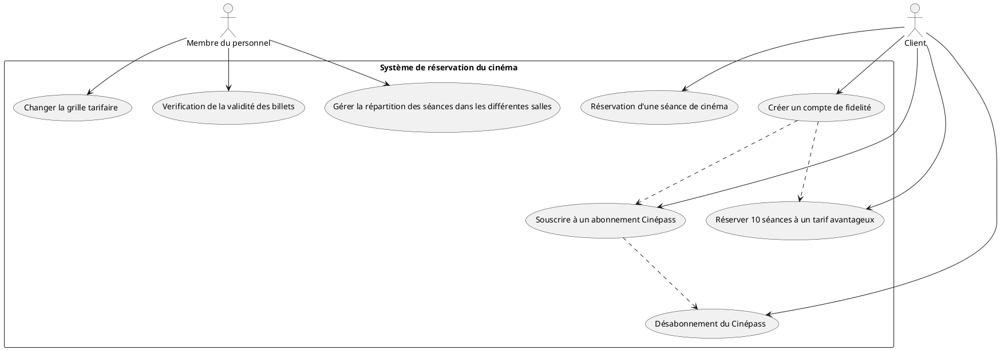

## Diagramme de classe

Notre diagramme de classe est orienté autour d'une classe centrale "Cinema". Celle-ci contient la liste des clients, les salles et séances, ainsi que les tickets réservés. Nous avons deux autres classes qui nous servent à manipuler notre système à partir de requete des clients ou des employés. D'une part, il y a "EmployeeMonitor" qui possède toutes les méthodes utiles aux employés pour modifier les tarifs, gérer les séances et pour vérifier la validité d'un ticket. D'autre part,
nous avons le Server qui reçoit les requetes des clients et fait les vérifications et enregistrement des informations auprès du système.

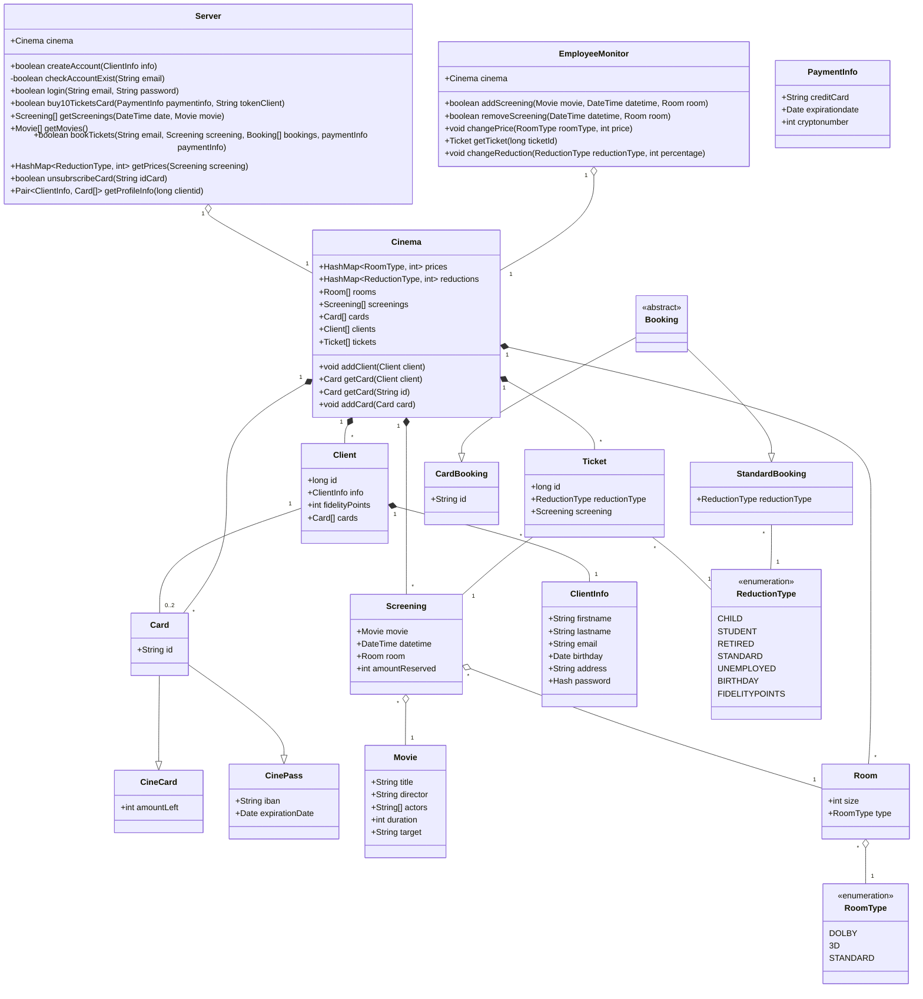

## Diagramme d'Etats

Nous avons donc un diagramme d'états centré autour des clients avec deux états : l'état connecté à un compte, et l'état sans compte. Chaque état permet au client de faire différentes actions, ou de mêmes actions réalisables différemments (réserver un ticket).

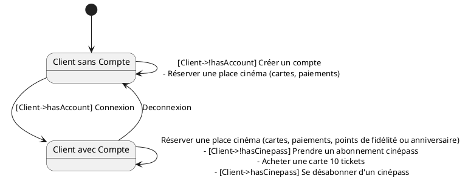

## Analyse Fonctionnelle et Comportementale pour chaque cas d'utilisation

### Création d'un compte client

L'utilisateur peut faire le choix de créer un compte client pour le cinéma. Pour cela, il doit se rendre sur le site du cinéma.
Sur celui-ci, il pourra trouver un bouton pour créer un compte qui l'amenera vers un formulaire de création de compte. Il pourra alors remplir les données utilisées pour la création d'un compte (nom, prénom, email, date de naissance, adresse et son mot de passe).
Une fois renseignées, ces informations sont envoyés au système et execute la fonction createAccount qui commencera par vérifier que la personne ne possède pas déja un compte. Si elle possède deja un compte, elle lui renverra un message d'erreur. Sinon elle stockera les informations du client comme compte client dans le système.
Le client recevra alors un message de succès.

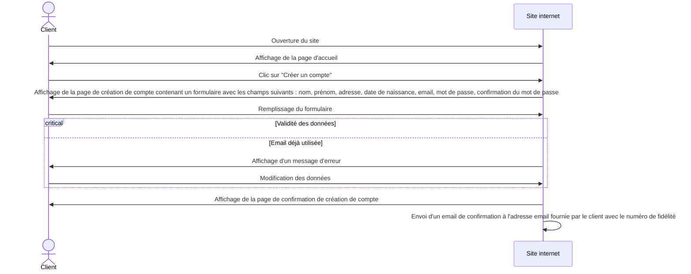

#### Diagramme de Séquence :

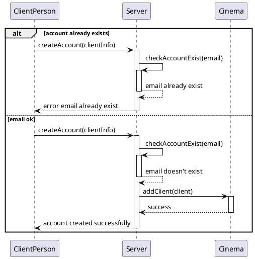

### Souscrire à un abonnement Cinépass


Le client souhaite souscrire à un abonnement Cinépass. Pour ce faire, il doit disposer d'un compte de fidelité.
Cette souscription s'effectue sur le site web du cinéma. Avant de procéder, le client doit s'identifier.

Si ce n'est pas déjà le cas, il est invité à rentrer son email et son mot de passe. Ces informations seront envoyées et vérifiées par le serveur. Si les identifiants sont corrects, le client est connecté. Sinon, il est invité à réessayer avec un message d'erreur.

Si le serveur détecte que le compte client est déjà associé à un Cinépass, un message d'erreur est renvoyé au client. Il ne peut pas souscrire à un autre Cinépass sur un même compte.

Une fois connecté, le client peut démarrer le processus de souscription. Pour ce faire, il doit rentrer un IBAN (qui servira à prélever le paiement tous les mois) et une address de facturation. Ces informations seront stockées par le serveur pendant la durée de l'abonnement.
Une fois ces informations rentrées et traitées par le serveur, le client est redirigé vers une page de confirmation de souscription. Il peut alors accéder à son Cinépass.

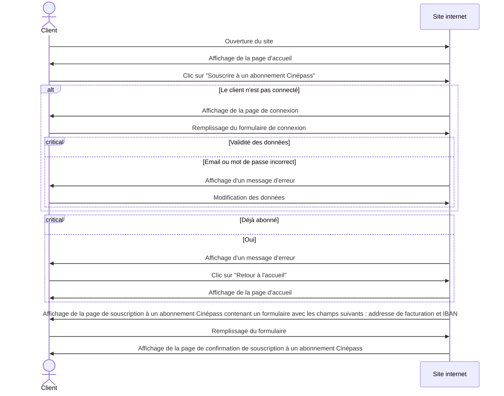

#### Digramme de séquence

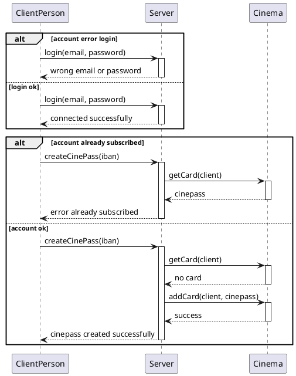

### Désabonnement du Cinépass

Une fois abonné, un client peut se désabonner de son Cinépass à tout moment. Il aura toujours accès à ses avantages jusqu'à la fin de son abonnement et il ne sera pas prélevé à nouveau.

Cette opération s'effectue sur le site web. Avant de procéder, le client doit s'identifier.

Si ce n'est pas déjà le cas, il est invité à rentrer son email et son mot de passe. Ces informations seront envoyées et vérifiées par le serveur. Si les identifiants sont corrects, le client est connecté. Sinon, il est invité à réessayer avec un message d'erreur.

Le serveur va ensuite vérifier si le client est abonné. Si ce n'est pas le cas, un message d'erreur est renvoyé au client et celui-ci peut retourner sur la page d'accueil.

Sinon, le serveur va vérifier si le client a déjà demandé un désabonnement. Si c'est le cas, un message d'erreur est renvoyé au client.

Sinon, le client sera invité à confirmer sa demande de désabonnement. Il devra alors rentrer son mot de passe pour confirmer. Si le mot de passe est correct, le serveur enregistre la demande de désabonnement et le client est redirigé vers la page d'accueil. Sinon, un message d'erreur est renvoyé au client et celui-ci peut réessayer.

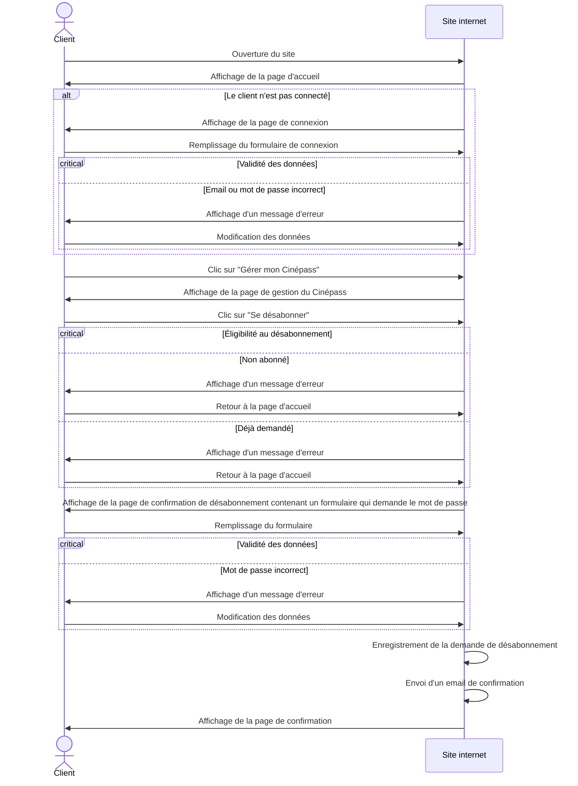

#### Digramme de séquence

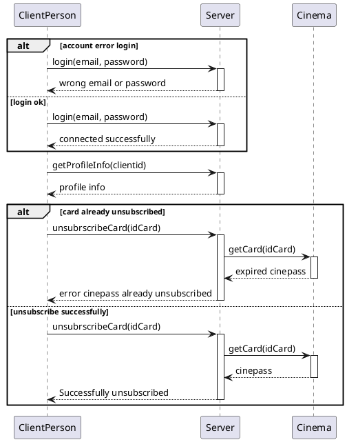

### Réserver 10 séances à un tarif avantageux (cinécarte)

Un client peut faire le choix d'acheter 10 places de cinéma en meme temps pour un prix plus avantageux. Ces places seront assignées à une carte lui permettant de réserver des séances cinémas en renseignant le numéro de carte.
Pour réserver 10 places, le client doit se rendre sur le site internet. Il peut alors ensuite cliquer sur un bouton "Achat d'une cinécarte". Il est alors invité à se connecter. Cette connexion est requise pour réserver les 10 places. Si il n'a pas de compte, il est invité à un en créer un. Sinon il peut renseigner ses informations de connexions. Le système reçoit ces informations et vérifie bien qu'elles correspondent bien à compte client. Si ce n'est pas le cas, elle renvoie un message d'erreur au client.
Sinon celui-ci est connecté et la page de paiement s'affiche devant lui. Il peut alors renseigner ses informations de paiements et valider. Les informations de paiements sont envoyés au serveur ainsi qu'un token (qui est généré lorsqu'un client se connecte). Ce token est utile pour reconnaitre quel client fait la requete au serveur.
Le système vérifie dans un premier temps que le client ne possède pas deja une carte contenant des places, si c'est le cas, il ajoutera 10 places à la carte si les informations de paiement sont corrects. Nous avons fait le choix de ne pas recréer de carte à chaque fois pour que le client puisse conserver toujours la meme carte et la recharger quand il le souhaite.
Si le client n'a pas de carte, une carte est alors créer avec 10 places dessus. Un message de succès est ensuite envoyé au client pour lui confirmer l'achat. Néanmoins, si le paiement échoue, un message d'erreur lui sera retourner l'invitant à revérifier ses informations de paiements.

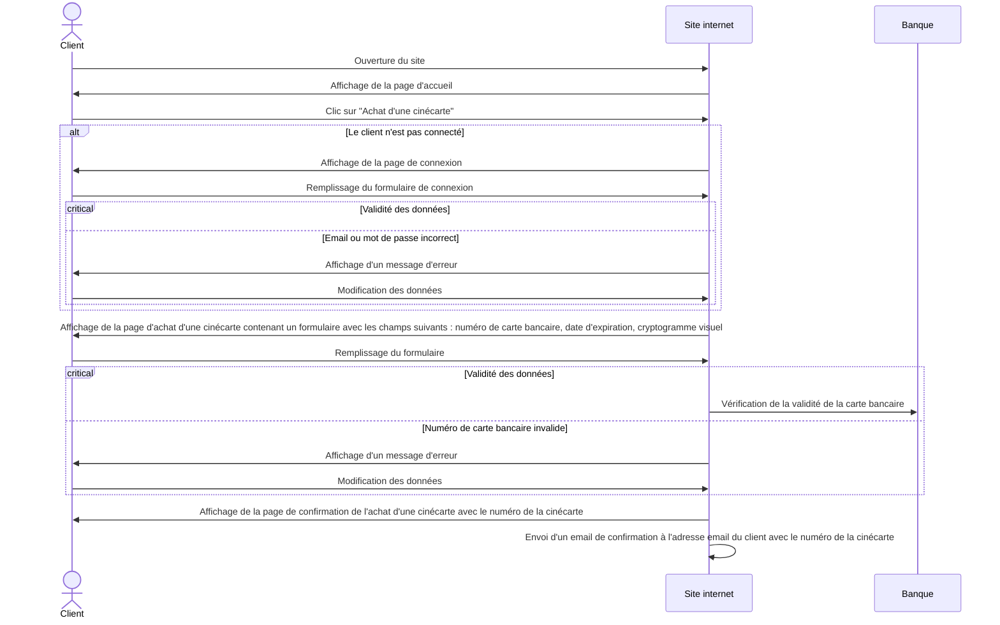

#### Diagramme de Séquence :

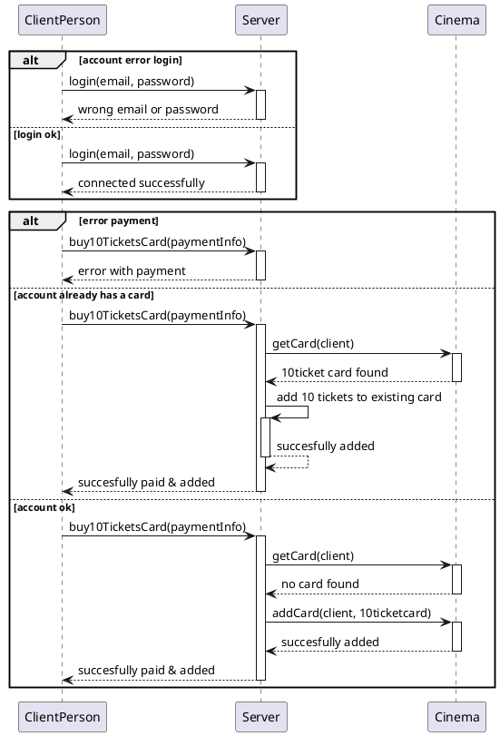

### Réserver un ticket de cinéma

Pour réserver un ticket de cinéma, un client peut utiliser une borne du cinéma ou alors se rendre sur le site internet. Dans ces deux cas, il peut effectuer la réservation en se connectant à son compte ou pas.
Dans tous les cas de figures, le client navigue d'une part parmi les films proposés, et ensuite parmi les séances disponibles dans le cinéma. 

Une fois son choix réalisé, il peut alors se connecter, créer un compte si il n'en a pas ou simplement ignorer la connection.

Si le client fait le choix de se connecter, le système lui proposera d'utiliser une carte cinépass ou de tickets si il en possède. Si c'est son anniversaire et qu'il n'a pas encore utilisé sa place gratuite il pourra également le faire à cette séance.
Si son nombre de points de fidélité est assez élevé, il pourra également payer une ou plusieurs places avec ses points. 

Si il ne se connecte pas, il est invité à entrer un email pour pouvoir recevoir ses places sur celui-ci.

Une requete est ensuite effectué pour récupérer les prix de la séance (qui dépendent du type de salle).
Il peut ensuite séléctionner le nombre de place qu'il souhaite, et choisir pour chaque place le moyen de paiement : Carte (en indiquant le numéro de carte si ce n'est pas l'une des siennes), anniversaire, fidélité ou standard).

Dans le cas d'un paiement standard, il peut choisir une réduction du prix de la séance en fonction du client qui prendra la place (Enfant, Etudiant, Retraité, Sans emploi, Sans réduction). Cette réduction est un pourcentage qui s'applique sur le prix de la séance.

Une fois les informations renseignées, une requete est faite au système qui va vérifier la validité des cartes utilisés et/ou de l'utilisation des points de fidélités/place anniversaire. Si il y a un problème, le système renvoie au client les informations qui ne vont pas.
Le client peut alors modifier son choix puis revalider. Si toutes les informations sont bonnes et que le client doit payer un montant supérieur à 0€, il est invité à payer par carte bancaire (ou espèces sur bornes). Le paiement est ensuite validé (ou non si erreur) et les places sont alors réservés (et crédités des cartes si elles sont utilisées).

Les tickets sont ensuite envoyés par mail au client qui a passé la commande.

#### Réservation sur le site internet

##### Avec un compte

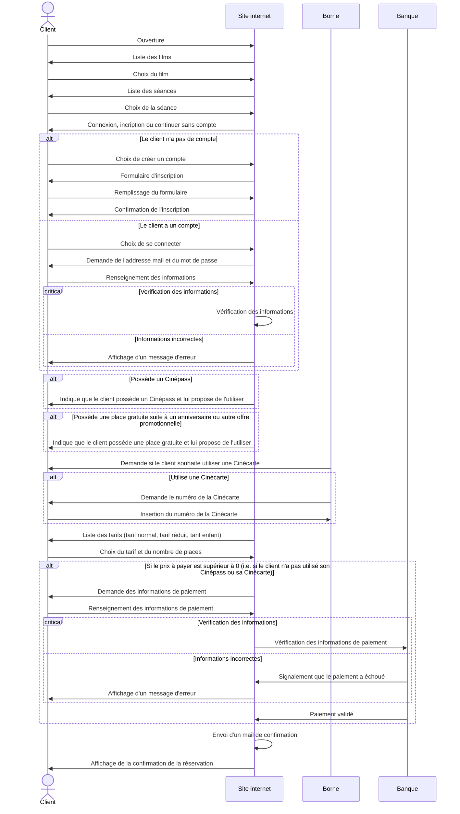

##### Sans compte

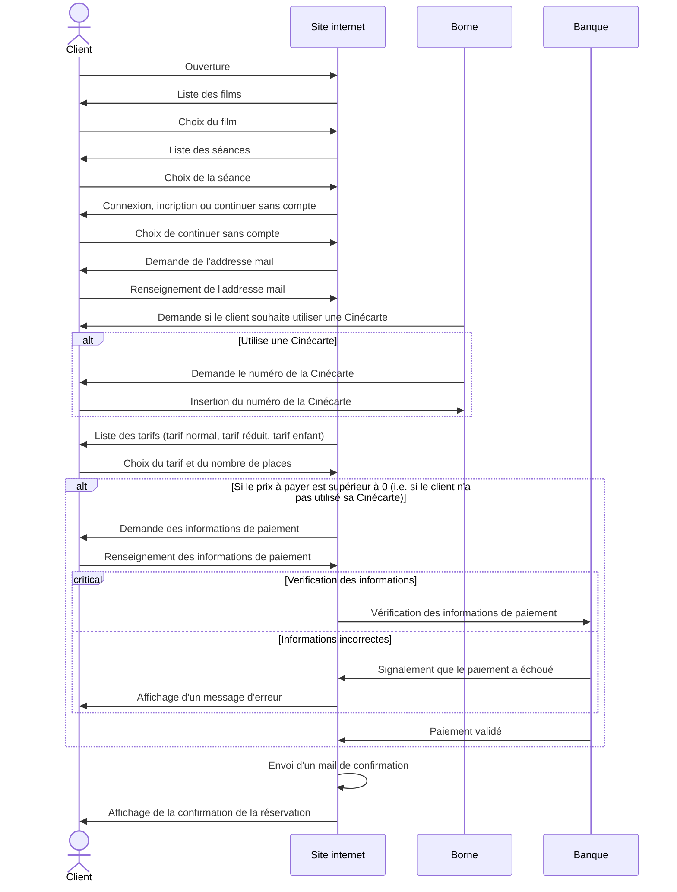


#### Réservation sur la borne
##### Sans compte

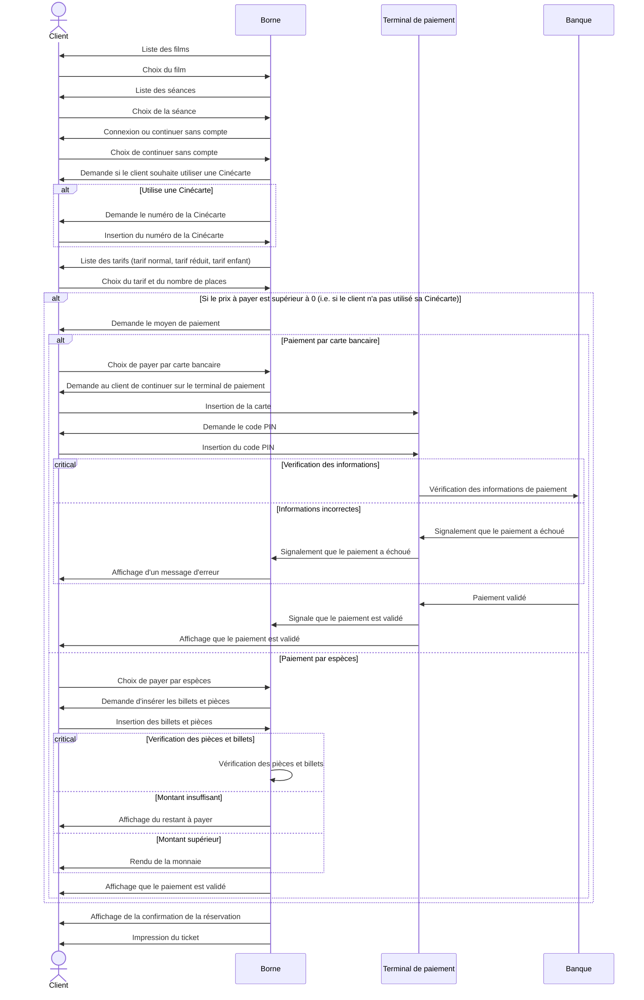

##### Avec compte

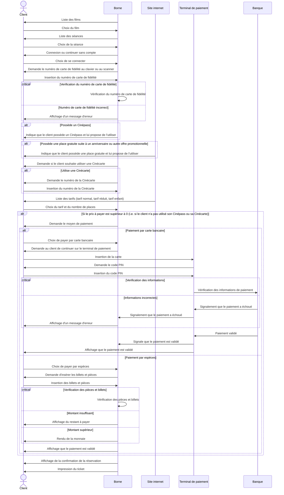

#### Diagramme de Séquence

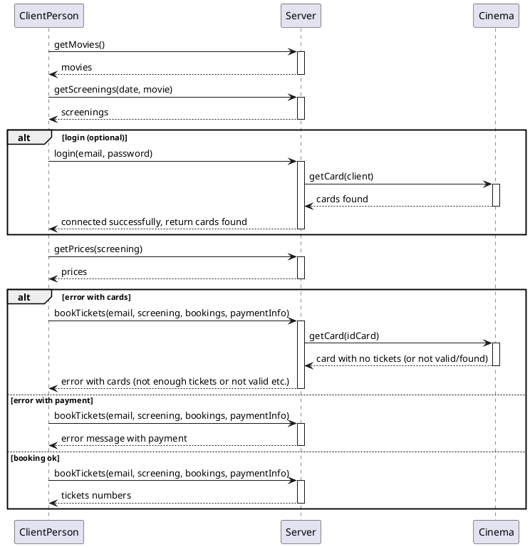

### Gérer la répartition des séances dans les salles

La gestion de la répartition des séances dans les salles est effectuée par un membre du personnel. Cette opération s'effectue sur un client accessible en interne, mais partageant la même base de données que le site web accessible au public.

Ce site n'est accessible que sur le réseau local du cinéma, il ne nécessite pas d'authentification supplémentaire.

Sur celui-ci, une rubrique "Répartition des séances" est disponible.
À partir de là, le membre du personnel peut former une association entre une salle, un film et un horaire.
Une fois cette association créée, le serveur va vérifier si la salle est disponible à l'horaire indiqué. Si c'est le cas, l'association est enregistrée et la salle est marquée comme occupée à l'horaire indiqué. Sinon, un message d'erreur est renvoyé au membre du personnel.

Ces modifications sont ensuite enregistrées par le serveur et appliquées sur le site web principal.
Les clients peuvent alors réserver des places pour cette séance.

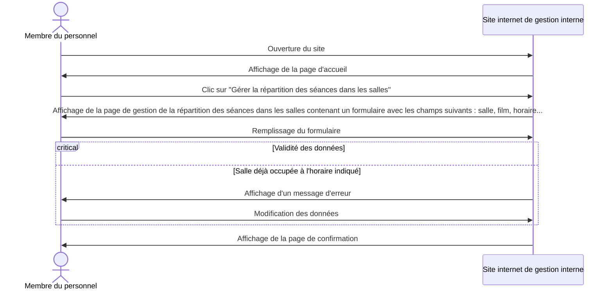
#### Digramme de séquence

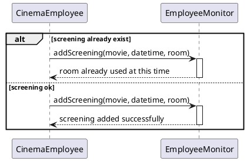

### Changer la grille tarifaire

Le changement de grille tarifaire est effectué par un membre du personnel. Cette opération s'effectue sur un client accessible en interne, mais partageant la même base de données que le site web accessible au public.

Ce site n'est accessible que sur le réseau local du cinéma, il ne nécessite pas d'authentification supplémentaire.

Sur celui-ci, une rubrique "Grille tarifaire" est disponible.
Elle permet de modifier les tarifs en fonction du type de salle (standard, 3D et Dolby) et également modifier les réductions à apporter aux étudiants, aux enfants et aux personnes âgées etc...
Ces modifications sont ensuite enregistrées par le serveur et appliquées sur le site web principal.

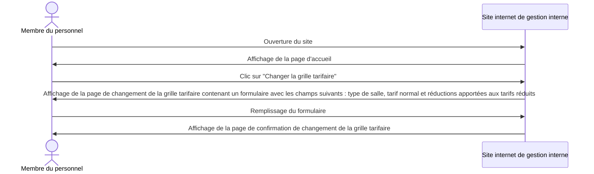

#### Digramme de séquence
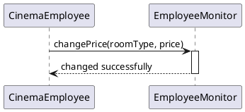

```plantuml
@startuml
CinemaEmployee -> EmployeeMonitor ++ : changeReduction(reductionType, percentage)
return changed successfully
@enduml
```

### Vérification des tickets des clients

Avant de pouvoir rentrer dans les salles, les clients doivent passer par un couloir d'accès où un employé du cinéma vérifie leur ticket.
Pour ce faire, il scan le code barre du ticket et une requete est effectué au système pour récupérer les informations du ticket.

Si le système ne renvoit aucune information, alors le ticket n'existe pas dans le système et n'est donc pas valide.
Le ticket peut également être invalide si il est associé à une séance passé ou trop éloigné de la date et heure actuelle.

Après un scan de ticket, l'employé peut voir quelle réduction a été appliqué lors de l'achat du ticket et donc demandé une pièce justificative si nécessaire.

```mermaid
sequenceDiagram
actor Membre du personnel
actor Client
participant Ordinateur de contrôle des entrées

Client->>Membre du personnel: Présentation du ticket pour la séance
Membre du personnel->>Client: Scan du ticket
Membre du personnel->>Ordinateur de contrôle des entrées: Vérification de la validité du ticket
critical Validité du ticket
    option Ticket invalide
        Ordinateur de contrôle des entrées->>Membre du personnel: Affichage d'un message d'erreur
        Client->>Membre du personnel: Demande d'un nouveau ticket
end
alt Le ticket nécessite un contrôle des pièces justificatives
    Membre du personnel->>Client: Demande des pièces justificatives (carte d'itentité...)
    Client->>Membre du personnel: Présentation des pièces justificatives
    critical Validité des pièces justificatives
        Membre du personnel->>Membre du personnel: Vérification des pièces justificatives
        option Pièces justificatives invalides
            Membre du personnel->>Client: Demande d'une nouvelle pièce justificative
        end
end
Ordinateur de contrôle des entrées->>Membre du personnel: Affichage du nom du film et de la salle
Membre du personnel->>Client: Indique la salle à rejoindre
```

#### Diagramme de séquence

```plantuml
@startuml
alt ticket id doesn't exist
CinemaEmployee -> EmployeeMonitor ++ : getTicket(ticketID)
return null
else ticket exist
CinemaEmployee -> EmployeeMonitor ++ : getTicket(ticketID)
return ticket (reductionType, Screening, id)
end
@enduml
```