# TP1 · Conception Orientée-Objet
## Mael KERICHARD - Romain BRIEND

L’objectif de ce TD/TP est de préparer un dossier complet d’analyse et de conception par Objet à partir d’un cahier des charges. 
Ce cahier des charges concerne un système de réservation d'un cinéma Pathé Gaumont. 

## Digramme de cas d'utilisation

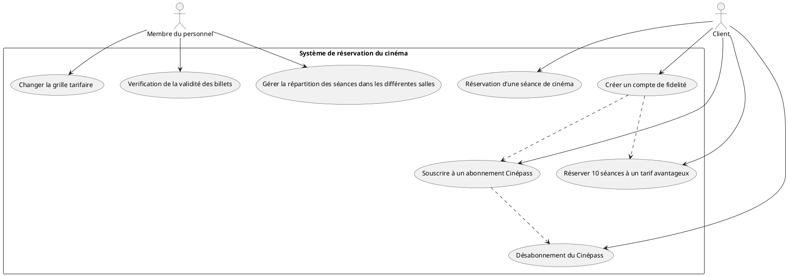

## Analyse des cas d'utilisation

### Souscrire à un abonnement Cinépass


Le client souhaite souscrire à un abonnement Cinépass. Pour ce faire, il doit disposer d'un compte de fidelité.
Cette souscription s'effectue sur le site web du cinéma. Avant de procéder, le client doit s'identifier.

Si ce n'est pas déjà le cas, il est invité à rentrer son email et son mot de passe. Ces informations seront envoyées et vérifiées par le serveur. Si les identifiants sont corrects, le client est connecté. Sinon, il est invité à réessayer avec un message d'erreur.

Si le serveur détecte que le compte client est déjà associé à un Cinépass, un message d'erreur est renvoyé au client. Il ne peut pas souscrire à un autre Cinépass sur un même compte.

Une fois connecté, le client peut démarrer le processus de souscription. Pour ce faire, il doit rentrer un IBAN (qui servira à prélever le paiement tous les mois) et une address de facturation. Ces informations seront stockées par le serveur pendant la durée de l'abonnement.
Une fois ces informations rentrées et traitées par le serveur, le client est redirigé vers une page de confirmation de souscription. Il peut alors accéder à son Cinépass.

#### Digramme fonctionnel
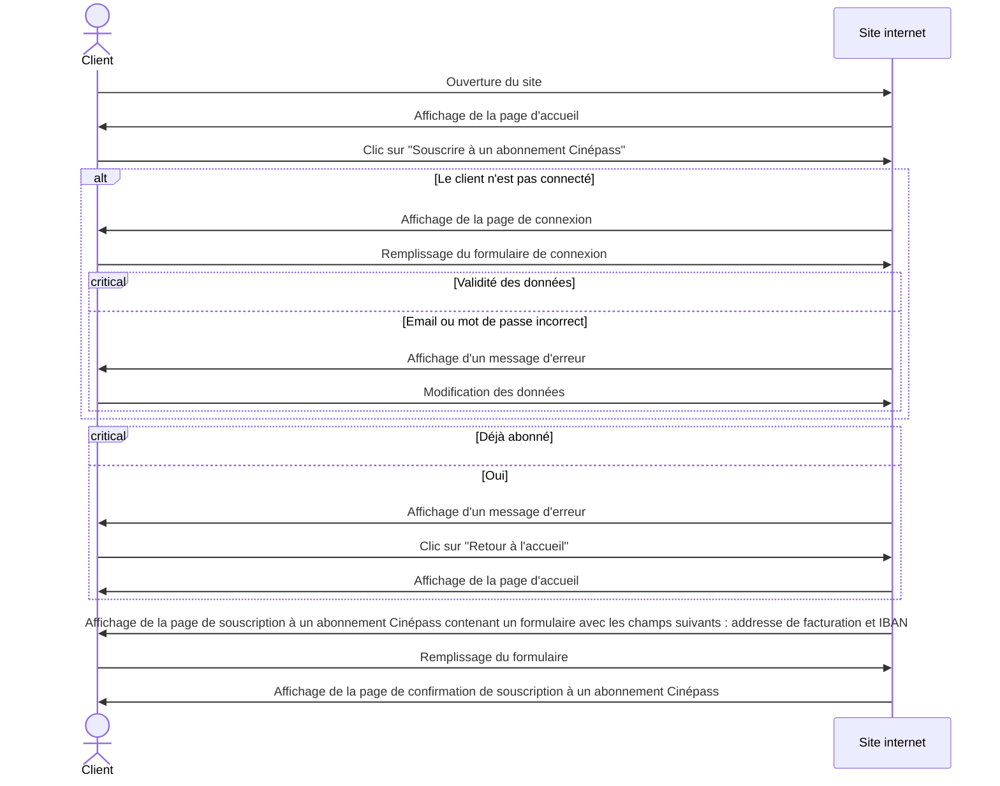

#### Digramme structurel

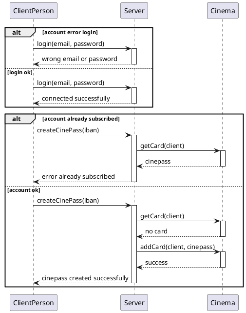

#### Analyse comportementale

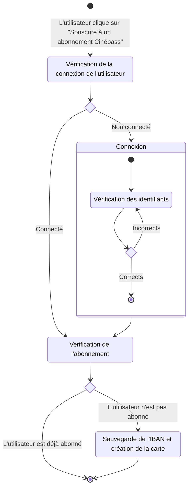


### Changer la grille tarifaire

Le changement de grille tarifaire est effectué par un membre du personnel. Cette opération s'effectue sur un client accessible en interne, mais partageant la même base de données que le site web accessible au public.

Ce site n'est accessible que sur le réseau local du cinéma, il ne nécessite pas d'authentification supplémentaire. 

Sur celui-ci, une rubrique "Grille tarifaire" est disponible. 
Elle permet de modifier les tarifs en fonction du type de salle (standard, 3D et Dolby) et spécifier les réductions à apporter aux étudiants, aux enfants et aux personnes âgées.
Ces modifications sont ensuite enregistrées par le serveur et appliquées sur le site web principal.

#### Digramme fonctionnel
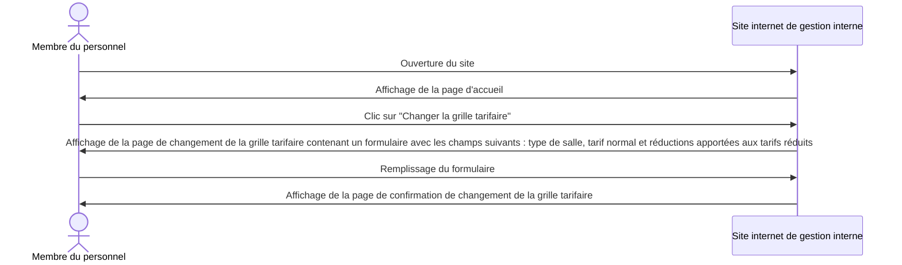

#### Digramme structurel
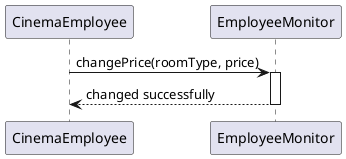

#### Analyse comportementale
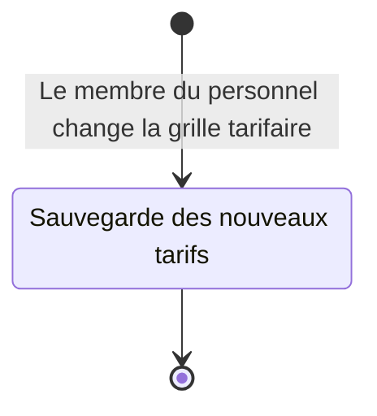

### Gérer la répartition des séances dans les salles

La gestion de la répartition des séances dans les salles est effectuée par un membre du personnel. Cette opération s'effectue sur un client accessible en interne, mais partageant la même base de données que le site web accessible au public.

Ce site n'est accessible que sur le réseau local du cinéma, il ne nécessite pas d'authentification supplémentaire.

Sur celui-ci, une rubrique "Répartition des séances" est disponible.
À partir de là, le membre du personnel peut former une association entre une salle, un film et un horaire.
Une fois cette association créée, le serveur va vérifier si la salle est disponible à l'horaire indiqué. Si c'est le cas, l'association est enregistrée et la salle est marquée comme occupée à l'horaire indiqué. Sinon, un message d'erreur est renvoyé au membre du personnel.

Ces modifications sont ensuite enregistrées par le serveur et appliquées sur le site web principal.
Les clients peuvent alors réserver des places pour cette séance.

#### Digramme fonctionnel
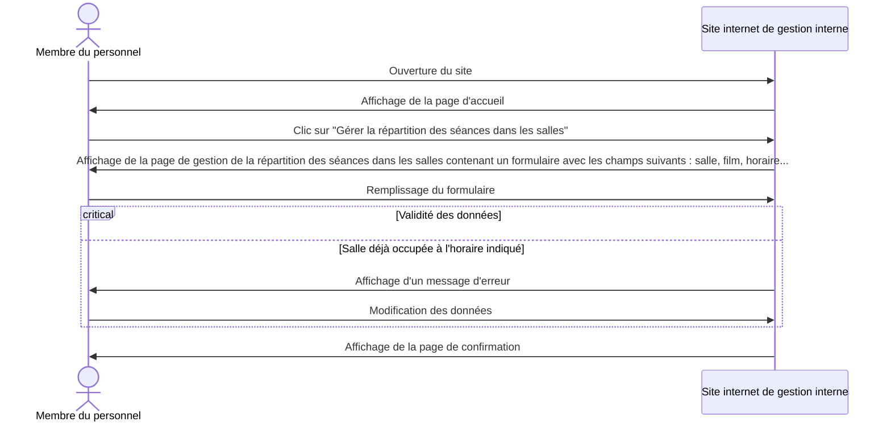
#### Digramme structurel
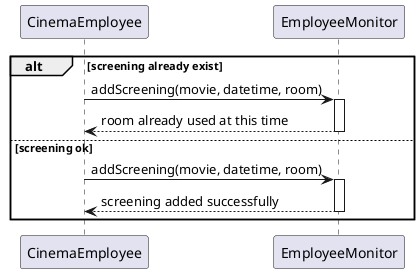

#### Analyse comportementale
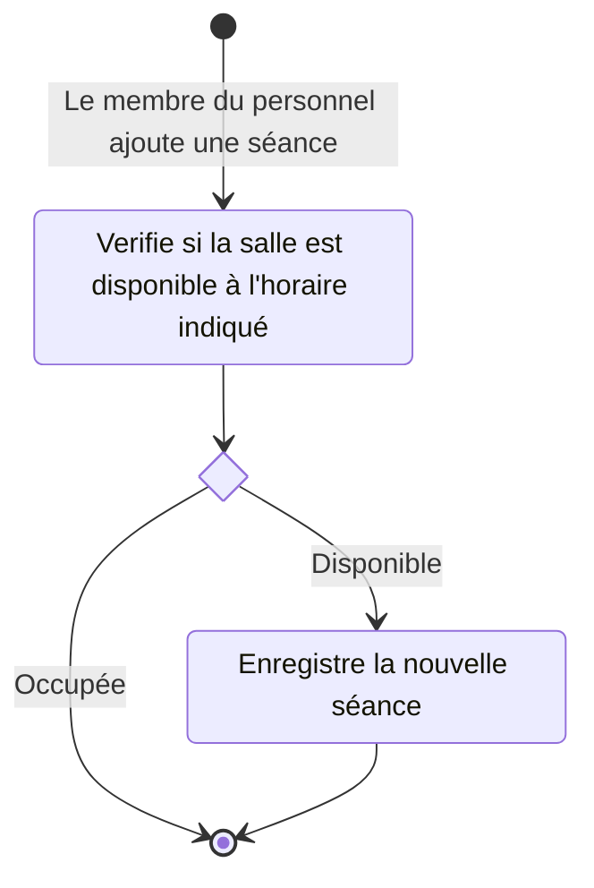

### Désabonnement du Cinépass

Une fois abonné, un client peut se désabonner de son Cinépass à tout moment. Il aura toujours accès à ses avantages jusqu'à la fin de son abonnement et il ne sera pas prélevé à nouveau.

Cette opération s'effectue sur le site web. Avant de procéder, le client doit s'identifier.

Si ce n'est pas déjà le cas, il est invité à rentrer son email et son mot de passe. Ces informations seront envoyées et vérifiées par le serveur. Si les identifiants sont corrects, le client est connecté. Sinon, il est invité à réessayer avec un message d'erreur.

Le serveur va ensuite vérifier si le client est abonné. Si ce n'est pas le cas, un message d'erreur est renvoyé au client et celui-ci peut retourner sur la page d'accueil.

Sinon, le serveur va vérifier si le client a déjà demandé un désabonnement. Si c'est le cas, un message d'erreur est renvoyé au client.

Sinon, le client sera invité à confirmer sa demande de désabonnement. Il devra alors rentrer son mot de passe pour confirmer. Si le mot de passe est correct, le serveur enregistre la demande de désabonnement et le client est redirigé vers la page d'accueil. Sinon, un message d'erreur est renvoyé au client et celui-ci peut réessayer.

#### Digramme fonctionnel
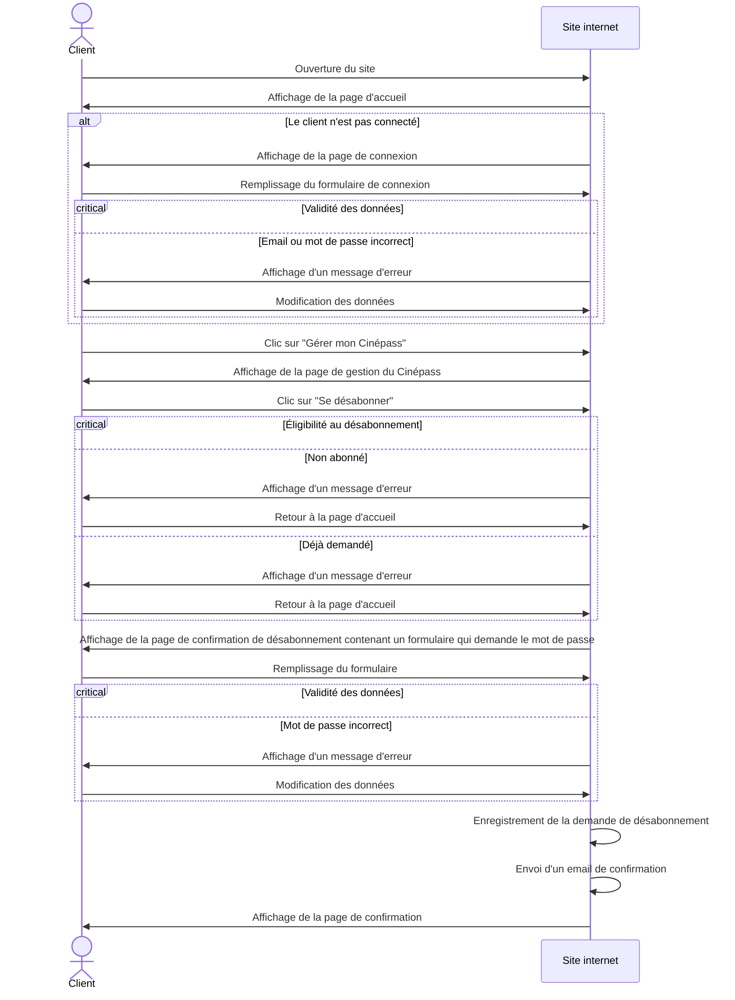

#### Digramme comportemental
```mermaid

```
